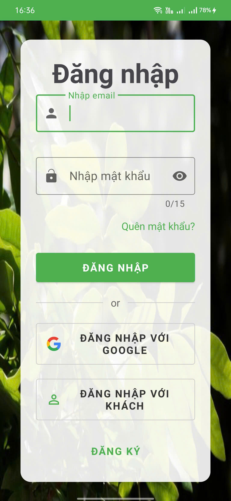
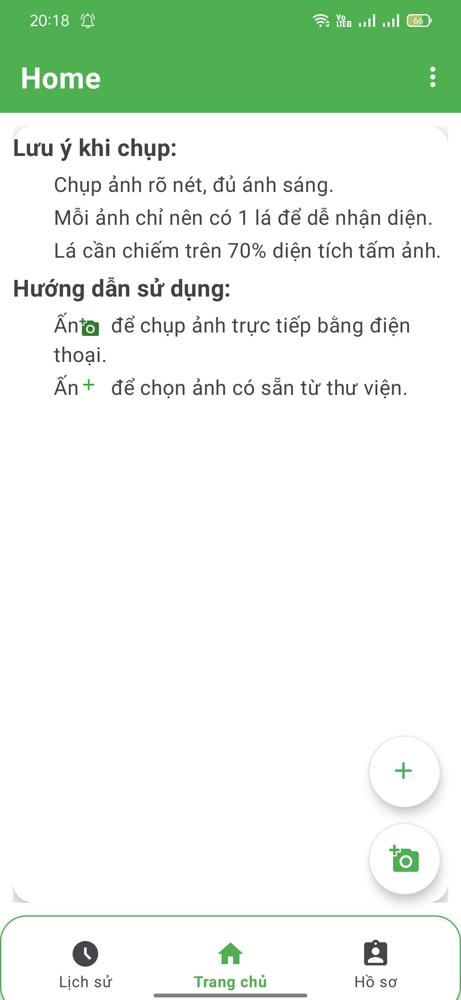

# Longan Cultivar Variant Detection App for Android
This repo is in scope of my university scientific research, which consists of Classification Models Training and App Integration, to create an Android app with Java for orchid owners use. The training pipeline was set up on Google Colab environment, using Tensorflow + Keras then apply quantization to generate a Tensorflow Lite model with input type uint8. The model then be integrated to this app using Tensorflow Lite library.
## App pictures


## Functions
- Support Anonymous users
- Sign up/ Sign in with Email/Password
- Forgot/ Change password
- Clasify variant by uploaded image/ taken picture
- View/ Delete classification history.
- Manage profile (Display name, Email Link if Anonymous)
## Prerequisites: 
- Java version >= 17
- Firebase Blaze ( with Free tier limit - for Authentication and Storage)
- Dependency management with Gradle Kotlin DTS
- Theme with MaterialComponent
# For usage
- Download [Android Studio](https://developer.android.com/studio?hl=vi) for rich-supported environment.
- Clone repo
  ```
  git clone https://github.com/LeHoangMinhQuan/longan_variant_detect_app.git
  cd longan_variant_detect_app
  ```
- Open 'build.gradle.kts' (App level) and click "Sync Now" for dependencies downloading.
- Run the project.
  
## For debugging with real devices
- Enable "Developer Mode" on your phone"
- In "Developer Options" turn on USB Debugging.
- Use your phone cable connect your PC with your phone, accept the RSA key if the dialog appears.
- Now, click Run 'app' or `Shift + F10`
- The app Login Page will be opened on your screen.

# Improvements needed
- Only support 4 variants, can be develop to support wider range.
- Model only fits with 1 leaf takes > 70% image, need Object Detection/ Object Segmentation first. 
- Basic UI due to old library, Flutter or Kotlin would be nice.

